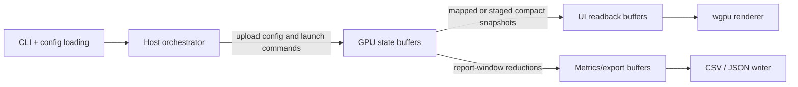

# Architecture

## Execution Model

MoonAI follows a **GPU-first execution model**.

- The GPU owns simulation state, evolution state, compiled networks, and report-window aggregation state.
- The CPU is an orchestrator only: it loads config, allocates buffers, launches kernels, polls compact status, and writes exported artifacts.
- There is **no duplicate host-side implementation** of simulation, evolution, inference, speciation, or verification logic.
- Host-side Rust types may exist for FFI layouts, launch parameters, and compact readback structs only.

## Ownership Boundaries

## Runtime Flow

## Cadence Rules

- `report_interval_ticks` controls artifact export cadence only. It governs when `stats.csv`, `species.csv`, `genomes.json`, and related report data are produced.
- UI `speed_multiplier` controls visualization cadence only. `1x` refreshes the UI every tick, `8x` refreshes the UI every 8 ticks, and in general the UI refreshes when `tick % speed_multiplier == 0`.
- These cadences are independent. A report export may occur on a tick that does not trigger a UI refresh, and a UI refresh may occur on a tick that does not trigger artifact export.
- A UI refresh must carry the full population render state: all active predator, prey, and food positions, predator/prey movement directions, and aggregate overlay statistics.
- Selected-agent inspection is additive. The selected agent adds vision, sensor, and neural-network inspection data on top of the normal full-population render path.

## Verification Strategy

Verification stays GPU-only as well.

- Kernel smoke tests validate launch, memory layout, and readback contracts.
- Device-side invariant checks validate genome bounds, node counts, connection counts, and compiled-network ranges.
- Fixed-seed determinism tests compare compact GPU readbacks across repeated runs on the same machine.
- End-to-end runtime tests validate output schema and artifact generation.

There is no separate CPU reference implementation used to confirm algorithm correctness.

## Readback Rules

- Per-frame UI render data should stay on GPU whenever possible through direct device-side interop or device-to-device copies.
- If UI interop requires host-visible staging, those transfers must happen on the UI refresh cadence, not on every simulation tick.
- A UI frame must include full-population render state, not only the selected agent.
- CPU-visible inspection data should stay limited to compact snapshots such as overlay counters and selected-agent inspection results.
- Metrics export must use GPU-side reduction first, then copy only compact report structs needed for `stats.csv`, `species.csv`, and `genomes.json`.
