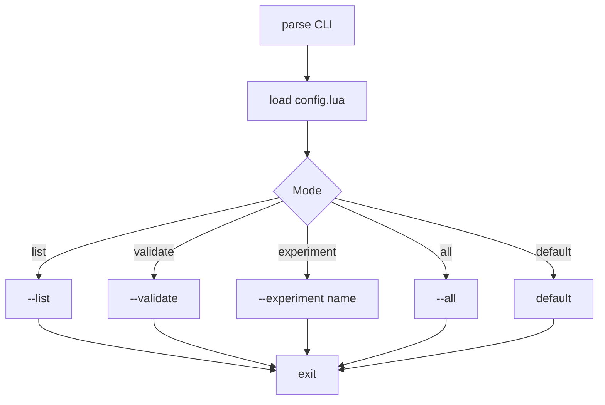
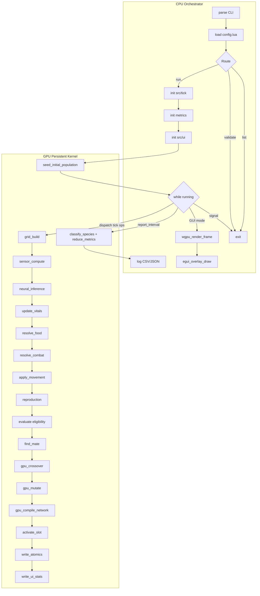
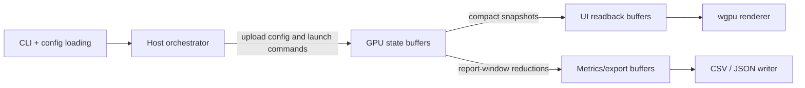
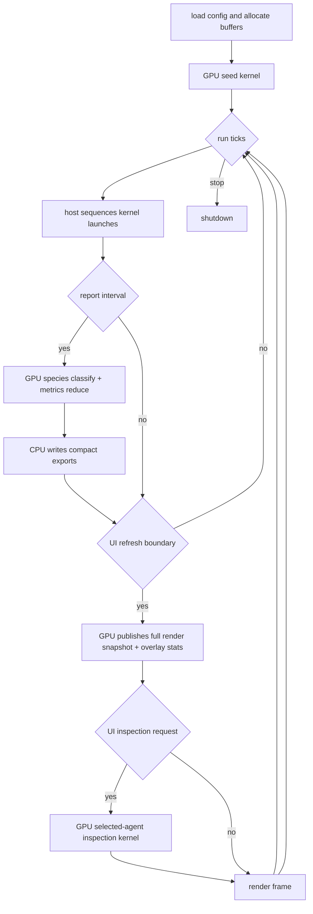

# Architecture

## Design Principles

MoonAI follows a **GPU-first execution model**.

- **GPU owns all simulation state** — positions, velocities, energy, age, alive flags, genomes, compiled networks, innovation counters, and species metadata live in GPU memory.
- **CPU is orchestrator only** — it loads config, allocates buffers, launches kernels, and writes files from compact readbacks. It does not maintain or execute a population-wide simulation, evolution, or verification path.
- **Tick-based cadence** — GPU runs initialization, simulation, evolution, report-window reduction, and on-demand inspection kernels. CPU only sequences those launches.
- **GPU-native evolution** — seeding, crossover, mutation, network compilation, and species classification happen entirely on GPU via the evolution portion of `src/tick/`.
- **Cadence separation** — `report_interval_ticks` controls CSV/JSON/species/genome export cadence, while UI `speed_multiplier` controls visualization refresh cadence. They are independent.
- **Readback/interop is minimal** — only the current UI-frame render snapshot, selected-agent inspection buffers, and report/export structs are transferred out of the simulation buffers.
- **No duplication** — there is no separate CPU algorithmic path for evolution, inference, speciation, or verification. Host Rust may define FFI layouts and export structs only.
- **Generated shared POD ABI** — Shared Rust/CUDA enums and structs are defined in Rust and emitted to a generated C++ header from `build.rs`. CUDA internal runtime state stays opaque to Rust.
- **Buffer expansion** — buffers grow by 2x when capacity threshold is reached. No artificial ceiling.

## Desicions

- `config.lua` contains **simulation config only** (no UI overrides).
- `settings.json` contains **UI config** — loaded from binary directory or explicit path.
- File locations: `config.lua` and `settings.json` live next to the binary executable.
  Lookup order: explicit path via CLI flag → binary directory → fallback to defaults.
- `UiConfig` defaults are hardcoded in Rust; `settings.json` overrides them.
- `UiState` (paused, speed_multiplier, tick_requested, selected_agent_id) is **runtime state**,
  lives in `src/ui/types.rs`. NOT in the config-loading modules.
- Predator and prey use separate GPU buffers; no `AgentType` enum needed.
- `config.lua` is loaded via `mlua`. `moonai_defaults` is injected as a global table.
- CLI `--experiment` flag is a string passthrough; experiment selection logic lives in the root binary entrypoint.
- Initial population seeding happens on GPU.
- `report_interval_ticks` is the artifact-export cadence only. It controls when the runtime writes `stats.csv`, `species.csv`, `genomes.json`, and related report data.
- UI `speed_multiplier` is the visualization cadence only. `1x` means refresh UI every tick, `8x` means refresh UI every 8 ticks, and so on.
- A UI refresh must include all active predators, prey, and food needed for rendering, plus aggregate population statistics.
- Reproduction is **sexual** — two parent genomes crossover on GPU, mutation applied on GPU, network compiled on GPU.
- Species classification happens on GPU at report intervals so `species.csv`, species counts, and representative-genome export do not require a host-side genome walk.
- FPS target: 120fps. Speed multiplier: 1x-1024x ticks per frame. Every frame renders everything live.
- Selected-agent inspection is additive: the main view always renders the full population, and selection only requests extra vision/sensor/network data for that one agent.
- UI needs fresh data every UI refresh: population counts, positions, and movement directions for all visible agents.
- Verification must rely on GPU-side invariants, fixed-seed determinism, readback schema checks, and end-to-end runtime tests. There is no CPU reference implementation for algorithm validation.

## Technology Choices

| Technology         | Choice                                                         |
| ------------------ | -------------------------------------------------------------- |
| Language           | Rust 2024                                                      |
| CUDA binding       | Rust FFI + generated C++ header + `nvcc` via `build.rs` / `cc` |
| Logging            | `tracing` + `tracing-subscriber`                               |
| JSON               | `serde` + `serde_json`                                         |
| Lua binding        | `mlua` crate                                                   |
| GUI framework      | winit + egui + wgpu                                            |
| GPU rendering      | wgpu instanced rendering                                       |
| Atomic counters    | CUDA atomics for GPU-to-CPU events                             |
| Genome compilation | GPU (persistent kernel)                                        |

## Cadence Rules

- `report_interval_ticks` controls artifact export cadence only. It governs when `stats.csv`, `species.csv`, `genomes.json`, and related report data are produced.
- UI `speed_multiplier` controls visualization cadence only. `1x` refreshes the UI every tick, `8x` refreshes the UI every 8 ticks, and in general the UI refreshes when `tick % speed_multiplier == 0`.
- These cadences are independent. A report export may occur on a tick that does not trigger a UI refresh, and a UI refresh may occur on a tick that does not trigger artifact export.
- A UI refresh must carry the full population render state: all active predator, prey, and food positions, predator/prey movement directions, and aggregate overlay statistics.
- Selected-agent inspection is additive. The selected agent adds vision, sensor, and neural-network inspection data on top of the normal full-population render path.

## Verification Strategy

Verification stays GPU-only as well.

- Kernel smoke tests validate launch, memory layout, and readback contracts.
- Device-side invariant checks validate genome bounds, node counts, connection counts, and compiled-network ranges.
- Fixed-seed determinism tests compare compact GPU readbacks across repeated runs on the same machine.
- End-to-end runtime tests validate output schema and artifact generation.

There is no separate CPU reference implementation used to confirm algorithm correctness.

## Readback Rules

- Per-frame UI render data should stay compact. The current runtime compacts live predators, prey, and food into contiguous render snapshots on the GPU, then copies only those compact arrays to host memory on the UI refresh cadence.
- The hot path must not rasterize the full world on the CPU. Host-side UI work should stop at compact readback and instance-buffer uploads for the custom `wgpu` world pass.
- A UI frame must include full-population render state, not only the selected agent.
- CPU-visible inspection data should stay limited to compact snapshots such as overlay counters and selected-agent inspection results.
- Metrics export must use GPU-side reduction first, then copy only compact report structs needed for `stats.csv`, `species.csv`, and `genomes.json`.

## CLI routing



## Tick Execution Flow



## Ownership Boundaries



## Runtime Flow



## GPU Kernel Reference

### `crossover.cu` — High-Level Algorithm

```
gpu_crossover_kernel(parent_a_ptr, parent_b_ptr, offspring_ptr, rng_state_ptr):
    tid = blockIdx.x * blockDim.x + threadIdx.x
    if tid >= num_offspring: return

    // 1. Read parent connection arrays into shared memory (32 threads cooperatively)
    // 2. Warp-level bitonic sort by innovation number
    // 3. Merge phase:
    //    for each innovation in union:
    //      if in both parents:
    //        inherit = (rand() < 0.50) ? parent_a : parent_b
    //      elif in one parent:
    //        inherit = (rand() < 0.50) ? parent_with_gene : DISABLED
    // 4. Disable mismatched with 75% probability
    // 5. Write child genome to offspring_ptr
```

### `mutation.cu` — High-Level Algorithm

```
gpu_mutate_kernel(genome_ptr, innovation_counter, rng_state_ptr, config):
    tid = blockIdx.x * blockDim.x + threadIdx.x
    if tid >= num_agents: return

    // Per-agent mutations (independent):

    // Weight perturbation
    if rand() < config.weight_mutation_rate:
        for each connection:
            if rand() < config.prob_mutate_weight:
                weight += Gaussian(rand(), config.weight_perturb_strength)

    // Add connection
    if rand() < config.add_connection_rate:
        for attempt in 0..max_attempts:
            from, to = random_node_pair()
            if not has_connection(genome, from, to):
                new_innov = atomic_inc(innovation_counter)
                add_connection(genome, from, to, new_innov)
                break

    // Add node
    if rand() < config.add_node_rate:
        conn = random_enabled_connection(genome)
        if conn exists:
            new_node = atomic_inc(next_node_id)
            disable_connection(genome, conn)
            i1 = atomic_inc(innovation_counter)
            i2 = atomic_inc(innovation_counter)
            add_connection(genome, conn.from, new_node, i1)
            add_connection(genome, new_node, conn.to, i2)
```

### `network_compilation.cu` — High-Level Algorithm

```
gpu_compile_network_kernel(slot_id, genome_ptr, inference_ptr):
    // 1. Topological sort nodes → eval_order[]
    // 2. Build conn_ptr[] — offset into conn_from[] for each node
    // 3. Copy weights, enabled flags into inference arrays
    // 4. Mark output node indices
```

## GPU-Side Innovation Tracking

NEAT innovation tracking requires assigning globally unique innovation IDs to new structural mutations. A GPU hash map (open addressing) suffers from bank conflicts under heavy concurrent insert from thousands of threads. Instead, use **atomic counter + direct assignment**:

```
Global GPU state:
  innovation_counter: atomic<uint32>   // monotonic, starts at (num_inputs + num_outputs + 1)
  next_node_id: atomic<uint32>        // monotonic for hidden nodes

Per-tick innovation log (append-only):
  innovation_log[tick][innovation_id] = {from_node, to_node, innovation_type}
  // Used for matching homologues during crossover
```

**Mutation -- add_connection**:

1. Pick random `(from_node, to_node)` pair
2. Check if connection exists by scanning this agent's connection array (O(C), typically <500)
3. If not found and `num_connections < max_connections`: atomically increment `innovation_counter` -> new ID -> insert connection

**Mutation -- add_node**:

1. Pick random enabled connection `(a, b)` with innovation `I`
2. Atomically increment `next_node_id` -> hidden node `h`
3. Atomically increment `innovation_counter` twice -> `I1`, `I2`
4. Disable connection `(a, b)`, insert `(a, h): I1`, `(h, b): I2`

**Why this is fast**:

- No hash map contention -- atomics only on counter increments (1-2 ops each)
- Connection existence check is a simple linear scan -- O(C) is fine since most connections do not mutate
- All other mutations (weight perturbation, enable/disable) are data movement, no atomics

## UI Data Path

`report_interval_ticks` and UI `speed_multiplier` are separate runtime cadences.

- `report_interval_ticks` controls artifact export only.
- UI `speed_multiplier` controls visualization refresh only.
- `1x` means the UI refreshes every tick.
- `8x` means the UI refreshes every 8 ticks, so the runtime publishes the latest render snapshot only when `tick % 8 == 0`.
- These cadences are independent; a report tick may or may not coincide with a UI refresh tick.

Runtime UI refresh now uses a hybrid readback + GPU draw path.

```
GPU on UI refresh:
  write compact UiStats readback
  compact live predators -> contiguous RenderAgentReadback array
  compact live prey      -> contiguous RenderAgentReadback array
  compact live food      -> contiguous RenderFoodReadback array

CPU on UI refresh:
  copy UiStats + compact render snapshot to host
  rebuild food/prey/predator instance arrays once for that snapshot

wgpu world render pass:
  upload instance arrays into persistent vertex buffers
  draw food as instanced billboards
  draw prey/predators as instanced oriented triangles
  draw egui panels and selected-agent overlays around the world pass

UiStats readback contains:
  tick, predator_count, prey_count
  predator_births, prey_births
  predator_deaths, prey_deaths
  kills, food_eaten
  avg_predator_energy, avg_prey_energy
```

This keeps the heavy world draw path on the GPU while limiting host work to compact readback and instance-buffer uploads. The UI no longer builds a full `egui::ColorImage` or uploads a full-scene texture every frame.

**Selected Agent Readback (On Demand)**:

```
User clicks agent:
  GPU: kernel_compute_selected_agent_features(slot_id, staging_buffer)
    - sensor lines (5 nearest predators, prey, food)
    - vision circle
    - node activations (forward pass)
  CPU: cudaMemcpy async -> read staging buffer -> update NN panel
```

The selected-agent path does **not** replace the population render path. It augments the existing full-population view with extra inspection data for the chosen agent.

## Buffer Expansion

```
Trigger: when live_count > capacity * 0.9

Expansion:
  new_capacity = capacity * 2
  allocate new buffer (all SoA arrays)
  gpu_copy_all(old_buffer, new_buffer, live_count)
  swap buffer pointers

No artificial ceiling. Buffers grow as needed.
```

## Sensor Layout (35 inputs, unchanged)

- 5 nearest predators x 2 values (dx, dy)
- 5 nearest prey x 2 values
- 5 nearest food x 2 values
- Self energy, vel x, vel y (3 values)
- Wall proximity x, y (2 values)
